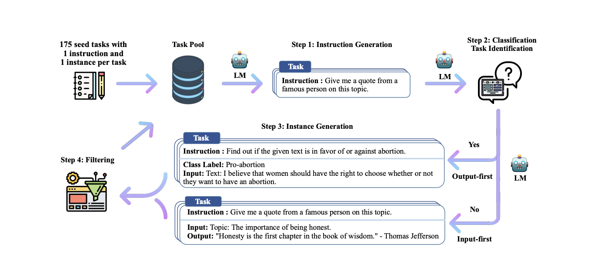

# self_instruct

The aim of this project to create Instruction dataset for health and fitness domain using an idea from self instruct paper. self instruct is  a framework for improving
the instruction-following capabilities of pretrained language models by bootstrapping off their own generations. 


## Data Set Creation

### Creating seed tasks 
1. I have consider three broader categories for creating Health and Fitness Instruction Data . \
        a. Physical Health \
        b. Mental Health \
        c. Fitness 

2. I have created more categories for each broader categories . I have attached a google sheets [[file]()] where you can find all the categories of each broader categories. 
3. I have created a one seed question for each sub categories and used that dataset and seed dataset to create multiple diverse instructions, inputs and Output.  


### creating dataset

Flow of Self Instruct Framework



# Installation

1. Clone the Git Hub Repo into your local workspace using the below code.
```sh
git clone https://github.com/ramachaitanya0/self_instruct.git
```

2. Create a Conda Environment.
```sh
conda create -n <env_name> python=3.10.14
```

3. Activate the conda Environment
```sh
conda activate <env_name> 
```

4. Install all the required Packages using requirements.txt file.
```sh
pip install -r requirements.txt
```
5. Add .env file in the Repo and add your OPEN AI Key, mail id and password in .env file.

```sh
OPENAI_API_KEY=<OPENAI_API_KEY>
```

# Usage

Run the Stream lit app using below code.
```sh
streamlit run Home.py
```


## Acknowledgements

 * Most of this code is derived from [[tatsu-lab](https://github.com/tatsu-lab)]'s [[stanford_alpaca](https://github.com/tatsu-lab/stanford_alpaca)], which is licensed under the Apache License, Version 2.0.
 * The full text of the license can be found in the LICENSE file included with this distribution.
 * I have Modified few files to create required datasets based on requirement.
 * If you want to read the paper of Self Instruct this is the self instruct paper [[link](https://arxiv.org/pdf/2212.10560.pdf)]


